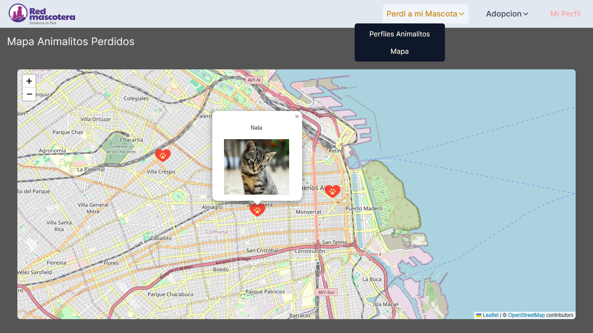

# 🔹 Red Mascotera - Frontend 🔹

## 🔅 Contenido

- [Web Preview](#🔅-preview)
- [Instalación del Proyecto](#🔅-instalación-del-proyecto)
  - [Etapa de Desarrollo](#🔶-etapa-de-desarrollo-🔶)
  - [Etapa de Stage](#🔶-etapa-de-stage-🔶)
- [Herramientas y Tecnologias](#🔅-herramientas-y-tecnologias)
- [Estructura con NextJS](#🔅-estructura-con-nextjs)

## 🔅 Preview

> Página web para la busqueda de animalitos perdidos y en adopción a través de perfiles y un mapa con su ubicación.



## 🔅 Instalación del Proyecto

### 🔶 Etapa de Desarrollo 🔶

##### Requerimientos:

- Tener instalado `node-20.9.0`
  - Puedes utilizar [`nvm`](https://github.com/nvm-sh/nvm?tab=readme-ov-file#installing-and-updating) (Node Version Manager) para crear una instancia de `node-20.9.0`.

##### Procedimiento:

1. Clonar el repositorio `https://github.com/redmascotera/redmascotera-front.git`.
2. Ingresar a la carpeta clonada con `cd redmascotera-front`.
3. Instalar las dependencias necesarias del proyecto con `npm install`.
4. Ejecutar el entorno de desarrollo con `npm run dev`.
5. Ahora puedes visitar tu `localhost:3000`.

### 🔶 Etapa de Stage 🔶

##### Requerimientos:

- Instalar [`Docker Desktop`](https://docs.docker.com/get-docker/) dependiendo de su sistema operativo.

##### Procedimiento:

1. Abrir `Docker Desktop` para iniciar el `docker-engine`.
2. Una vez clonado el repositorio `https://github.com/redmascotera/redmascotera-front.git`, ejecutar:

```
docker build -t TAG-NAME .
```

- Siendo `TAG-NAME` un nombre personalizado para su nueva imagen. Ej.: `rmfront`

```
docker build -t rmfront .
```

3. Terminado el proceso de `build`, ejecutar:

```
docker run --rm -p 3000:3000 rmfront
```

- Para arrancar el proyecto en su `localhost:3000` y visualizar la página que iria a producción.

## 🔅 Herramientas y Tecnologias

- `JavaScript` / `TypeScript`

- `npm` ( linea de comandos, gestor de paquetes, instalación de depencias, librerias, etc )

- [`Git Flow`](https://www.atlassian.com/es/git/tutorials/comparing-workflows/gitflow-workflow) ( flujo de trabajo, nombramiento de ramas )

- `Fetch` ( solicitudes, peticiones, api´s )

- [`NextJS`](https://nextjs.org/docs) ( framework, componentes cliente y servidor, interfaz de usuario dinámica )

- `Tailwind CSS` ( estilos, animaciones, colores, [extension VSCode](https://marketplace.visualstudio.com/items?itemName=bradlc.vscode-tailwindcss) )

- `Eslint y StandardJS` ([standard-with-typescript](https://github.com/standard/eslint-config-standard-with-typescript), reglas para formatear codigo )

  - Para activar el autoformateador de eslint al guardar un archivo en Visual Studio Code puedes ir a la configuración json:

  ```json
  "editor.codeActionsOnSave": {
    "source.fixAll.eslint": true
  }
  ```

- [`Leaflet`](https://leafletjs.com/), [`React Leaflet`](https://react-leaflet.js.org/) ( alternativa a la api de google maps )

## 🔅 Estructura con NextJS

> Se describe la estructura de carpetas del `app router` de NextJS

```
└── 📁app
    └── globals.css
    └── icon.png
    └── layout.tsx
    └── page.tsx
    └── 📁pet-adoption
        └── 📁maps
            └── page.tsx
        └── 📁profiles
            └── page.tsx
    └── 📁pet-lost
        └── 📁maps
            └── page.tsx
        └── 📁profiles
            └── page.tsx
    └── 📁sign-in
        └── page.tsx
    └── 📁sign-up
        └── page.tsx
```
